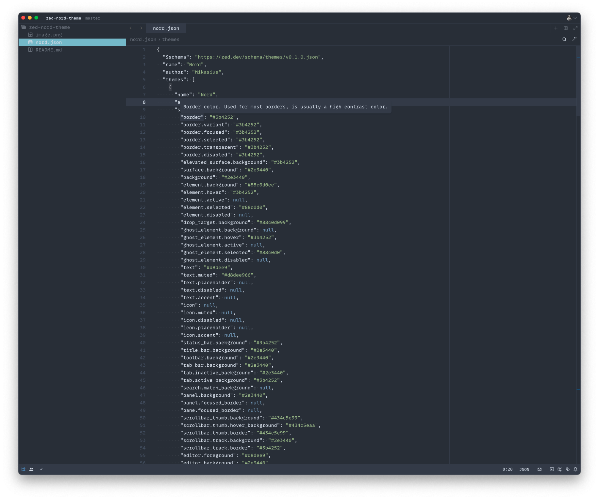

# zed-nord-theme

Created with https://zed.dev/blog/user-themes-now-in-preview  
Thanks to https://www.nordtheme.com/ports/visual-studio-code

Feel free to modify this theme.

Place `nord.json` in `~/.config/zed/themes`, restart Zed and select it from the command palette (`Cmd+Shift+P`) or (`Cmd+K Cmd+T`).

